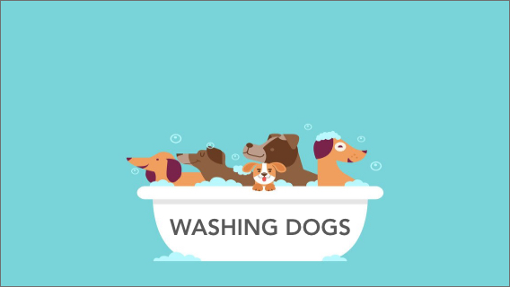

# Washing Dogs



> Esta es la [demo](https://zotapianola.github.io/SCL010-Battleship/) de nuestro proyecto

## Preámbulo

Battleship es un juego clásico, con múltiples versiones en juegos de mesa y en línea (si no lo conoces, puedes verlo en este link : [battle-ship](https://es.wikipedia.org/wiki/Batalla_naval_(juego))).

El juego es para dos personas. Consiste en que en un tablero cada jugador coloca un conjunto de barcos, ocultando su posición del contrincante. Luego, por turnos, van anunciando una posición del tablero y el enemigo informa si le han dado a uno de sus barcos o no. El juego termina cuando un jugador ha conseguido hundir todos los barcos del otro.

## Objetivo 🎯

El desafio de este proyecto fue iterar sobre la mecanica, del clásico juego Battleship una versión más actualizada, con la libertad de crear una tématica distinta como también de escoger las herramientas con las cuales trabajar en su desarrollo. Dentro de esto además se consideró analizar los principales Benchmarks disponibles, con la finalidad de lograr un producto distintivo, manteniendo el flujo del juego de forma similar al _standard_.

### Cómo jugar 🎮

- Ingresa al [juego](https://zotapianola.github.io/SCL010-Battleship/)
- Ingresa tu nombre para comenzar a jugar
- Da click en 'Crear Partida'
- Selecciona una pieza (perrito)
- Posiciona la pieza en el tablero seleccionando una celda
- Posiciona todas las piezas (perritos) en el tablero
- Da click en 'Guardar Tablero' para guardar tu juego
- Comparte por Whatsapp la invitación autogenerada para que un contrincante se una a la partida
- Luego selecciona 'Jugar'
- Ingresa el código que tu contricante te compartirá cuando este listo para jugar
- Selecciona 'Cargar Oponente'
- Visualizarás el tablero de tu oponente en la parte inferior
- Selecciona una celda del tablero de tu oponente para dar con sus piezas (perritos)
- Da click en 'Perrito Bañado' para visualizar la jugada de tu oponente en tu tablero
- Continua esta dinamica hasta que uno de los jugadores anuncie todas los piezas (perritos)
- Podrás seleccionar volver a jugar con el mismo oponente, la revencha o volver al inicio

```
El código de invitación se encuentra dentro del mensaje de invitación y es aquel que esta compuesto por letras y números aleatorios 
```

### Test con Usuarios 📲

-   **Nombre:**  Trinidad Vega
-   **Edad:**  19 años
-   **Ocupación:** Estudiante
-   **Experiencia de juego:**  Novata en Battleship
-   **Observaciones/Feedback:**
    -  Utiliza todos los botones
    - Preferiría que las piezas cambien de color en vez de mostrar símbolos
    - Le gustan los tonos de colores
    - No entiende qué indican los símbolos cuando se selecciona una casilla
    - Preferiría que los tableros tuvieran un color distinto a blanco

> El video de éste test se encuentra disponible [aquí](https://drive.google.com/file/d/1Y2UNoQsTd9cFiVq5URMy0L_S6FuHjsgp/view?usp=sharing)

-   **Nombre:**  Daniela Muñoz
-   **Edad:**  18 años
-   **Ocupación:**  Estudiante
-   **Experiencia de juego:**  Novata en Battleship
-   **Observaciones/Feedback:**
    -  Utiliza todos los botones
    - No entiende de quién es el turno de jugar
    - No entiende la temática del juego
    - Le gustaría poder cambiar la orientación de las piezas

-   **Nombre:**  Lukas Candia
-   **Edad:**  19 años
-   **Ocupación:**  Estudiante
-   **Experiencia de juego:**  Intermedio en Battleship
-   **Observaciones/Feedback:**
    -  Utiliza todos los botones
    - No entiende cuál es el tablero que debe atacar
    - No entiende la temática del juego
    
-   **Nombre:**  Valerie Hardy
-   **Edad:**  52 años
-   **Ocupación:**  Pedagoga
-   **Experiencia de juego:**  Novata en Battleship
-   **Observaciones/Feedback:**
    -  Utiliza todos los botones
    - Le gustaría poder cambiar la orientación de las piezas
    - Preferiría que las piezas cambien de color en vez de mostrar símbolos
    - Le gusta el concepto sobre la adopción de perros
    - Entiende la temática del juego

-   **Nombre:** Teva Cuevas
-   **Edad:**  18 años
-   **Ocupación:** Estudiante
-   **Experiencia de juego:**  Intermedio en Battleship
-   **Observaciones/Feedback:**
    -  Utiliza todos los botones
    - No entiende la mecánica de cómo jugar
    - Le gusta que el concepto sea sobre perritos

-   **Nombre:**  Areli Diaz
-   **Edad:**  25 años
-   **Ocupación:** Ing. Comercial
-   **Experiencia de juego:**  Novata en Battleship
-   **Observaciones/Feedback:**
    -  Utiliza todos los botones
    - Le gusta la frase final sobre la adopción de perritos
    - Le gustan los tonos de colores
    - No entiende la temática del juego

-   **Nombre:**  Barbara Rodriguez
-   **Edad:**  24 años
-   **Ocupación:** Bailarina
-   **Experiencia de juego:**  Novata en Battleship
-   **Observaciones/Feedback:**
    -  Utiliza todos los botones
    - Preferiría animar la imagen principal
    - No entiende qué indican los símbolos cuando se selecciona una casilla 
    - No entiende a quién le corresponde el turno de jugar

-   **Nombre:**  Angelo Pozo
-   **Edad:**  25 años
-   **Ocupación:** 
-   **Experiencia de juego:**  Intermedio en Battleship
-   **Observaciones/Feedback:**
    -  Utiliza todos los botones
    - No sabe cuál es el tablero del oponente
    - No entiende la temática del juego 
    - No entiende a quién le corresponde el turno de jugar
    - Le gustaría que los tableros fueran de un color distinto a blanco

## Construido con 🛠️

Las herramientas utilizadas para crear este proyecto fueron

* [React.js](https://reactjs.org/) - Framework para construir la Interfaz de Usuario
* [Firebase](https://firebase.google.com/) - Almacenamiento de datos
* [Material-UI](https://material-ui.com/) - Framework Design

### Herramienta de Planificación 

Fue utilizada la herramienta [Trello](https://trello.com/) para realizar la planificación del proyecto. <br>
Para acceder al tablero de plafinicación haz click [aquí](https://trello.com/b/k7U7ELO7).


### Herramienta de Diseño

Se realizo el prototipo de alta fidelidad en [Adobe XD](https://www.adobe.com/products/xd.html). <br>
Para acceder al prototipo haz click [aquí](https://xd.adobe.com/view/b48dfa56-9777-4e4e-5b3d-80937f8fec8d-c2bc/?fullscreen).
El wareframe o prototipo de baja fidelidad fue elaborado a mano y es el siguiente:


## Autores ✒️

* **Anabel Carrion** - *Trabajo funcional* - [anabelcarrion](https://github.com/anabelcarrion)
* **Estefania Romero C.** - *Diseño y Documentación* - [zotapianola](https://github.com/Zotapianola)
* **Scarlette Villarreal Á.** - *Trabajo funcional* - [villarrealscarlette](https://github.com/VillarrealScarlette)

También puedes mirar la lista de todos los [contribuyentes](https://github.com/Zotapianola/SCL010-Battleship/graphs/contributors) quíenes han participado en este proyecto.  